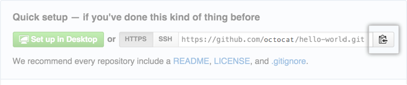

## استخدام موجه الأوامر مع git

ما تحتاج لمعرفته من الأوامر الرئيسية لنظام الإصدارات git هو الأمر الرئيسي

### 1. `git init`

هذا الأمر هو الذي ستبدأ معه دوماً عند بناء أي مشروع.

> تذكر أن عمل مستودع لا يعني دوما مشاركته على الانترنت، بالعكس أنا غالباً أقوم بعمل مستودع محلي قبل أن أبدأ بكتابة أي سطر برمجي ليتم حفظ جميع الخطوات التي تم بناء المشروع بها (محلياً).

بمجرد ما تكتب الأمر `git init` ستجد أنه تم إنشاء مجلد اسمه `.git` وهو يحتوي على كل شيء متعلق بالمستودع.


### 2. `git add .`

هذا الأمر يقوم بإضافةالملفات الموجودة في المشروع لتجهيزها قبل تثبيت التعديلات.

وهو يعادل حينما تضغط على Stage All Changes في GitKraken


### 3. `git commit -m "Message"`

آخر شيء هو تثبيث التعديلات باستخدام هذا الأمر.

بالتأكيد، بدلاً من Message بنكتب جملة مفيدة توضح ماهو التعديل الذي تم اضافته بالضبط مثلا:

> Add X feature
> Fix X bug
> Delete X files
> Update X

هذا الأمر يعادل زر Commit على GitKraken


## الأوامر السابقة لا تقوم برفع المستودع إلى GitHub

لرفع المشروع على GitHub ستحتاج إلى القيام بالتالي:

> بإمكانك القيام بهذه الخطوات باستعمال GitKraken وتريح بالك :relieved:

### 1. تقوم بإنشاء مشروع فارغ على GitHub.


### 2. تأخذ رابط المشروع من GitHub



مثال لرابط المشروع:

```
https://github.com/yaseralnajjar/django-vue-template
```

### 3. إضافة رابط المشروع على المستودع المحلي:

```
git remote add origin URL
```

طبعاً، بدل URL تكتب رابط المشروع... مثلاً في حالتي سيكون الأمر كالتالي:

```
git remote add origin https://github.com/yaseralnajjar/django-vue-template
```

*لإضافة رابط المستودع باستعمال GitKraken استعمل زر Add Remote


### 4. رفع التعديلات:

ما نحتاجه الآن هو رفع التعديلات على المشروع، نكتب في موجه الأوامر السطر `git push`

```
git push -u origin master
```