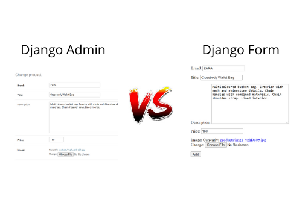

## أعرف أنك تتساءل

لدينا الآن طريقتين لإدارة المنتجات:

1. عن طريق لوحة تحكم جانقو Django Admin.
2. عن طريق الصفحات التي قمنا بإضافتها.

## الطريقة المثالية؟ :thinking:

باختصار لا يوجد طريقة مثالية، لأن الأمر يعتمد على نوعية العميل الذي تتعامل معه.

> القاعدة الذهبية هي أنه **إذا كان المشروع لعميل عادي (ما يفهم كثير في التقنية) حينها يجب أن يستعمل الصفحات المخصصة لإدارة المنتجات بدون أن يدخل على لوحة التحكم**.

> أما إذا كان العميل شخص فاهم في البرمجة فحينها بإمكانك إطلاعه على لوحة التحكم.

**الخلاصة أن لوحة التحكم لا يجب أن يصل لها شخص لا يفهم في التقنية لأنه يستطيع التلاعب بقاعدة البيانات الخاصة بالمشروع.**